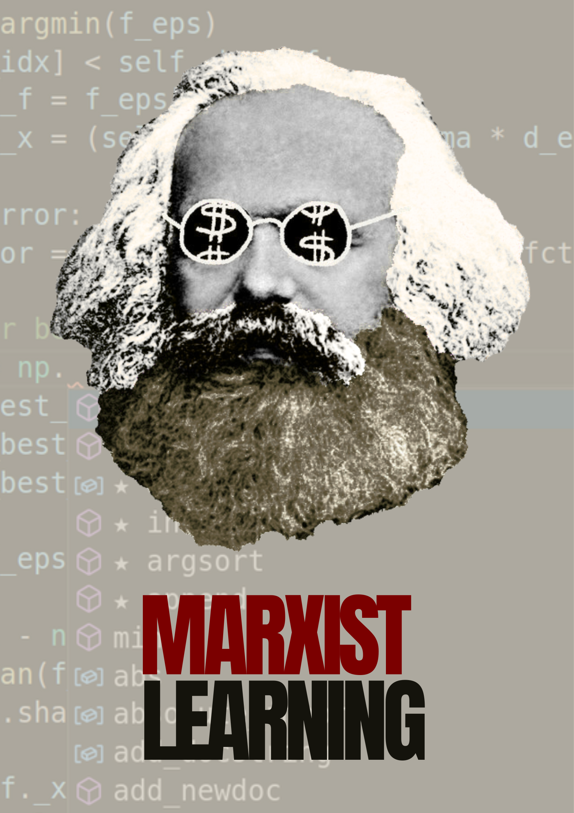

```{=html}
<div class="wide-page-shell about-me-shell">
  <header class="page-header-minimal" data-lang="en">
    <h1 class="page-title-minimal">About me</h1>
  </header>

  <header class="page-header-minimal" data-lang="es" style="display:none;">
    <h1 class="page-title-minimal">Sobre mí</h1>
  </header>

  <section class="page-wrap about-me-body" data-lang="en">
    <div class="about-me-layout">
      <div class="about-me-content">
        <h2 class="about-me-subtitle">Intellectual Trajectory toward <span class="kw kw--computational">Computational Social Science</span>: The machine <s>marxist</s> learning</h2>
        <p>My current research agenda converges on <span class="kw kw--computational">Computational Social Science</span>, although this path is not immediately apparent from my earlier work.</p>
        <p>In my undergraduate thesis I examined the process of reopening the sociology department at the Universidad de Concepción, one of the institutions most severely affected by Augusto Pinochet's dictatorship, which overthrew the first democratically elected socialist government in the world. In my master's thesis I expanded that agenda to study the creation of the Sociology program at the Pontificia Universidad Católica de Chile and the subsequent founding of the Centro de Estudios de la Realidad Nacional (CEREN), which was shut down once the dictatorship began.</p>
        <p>Although this trajectory might be read as belonging to a qualitative, Latin Americanist tradition, it in fact points to something more precise: the ruptures and continuities of thought in the social sciences. That underlying question is what led me to <span class="kw kw--computational">Computational Social Science</span>.</p>
        <p>The continuity is deeper than it appears. In both moments, the central object is the relationship between <span class="kw kw--power">power</span>, knowledge, and the public sphere. Previously, that relationship manifested in the closure of a university department or the shutdown of a research center. Today it manifests in <span class="kw kw--methods">algorithms</span> that determine which political discourse circulates, in <span class="kw kw--methods">language models</span> that shape public opinion, and in automated disinformation that erodes the epistemic conditions of <span class="kw kw--democracy">democracy</span>.</p>
        <p>My training in <span class="kw kw--methods">textual analysis</span> — rooted in the hermeneutic tradition of the social sciences and in systematic work with historical sources — now extends toward large-scale <span class="kw kw--computational">computational text processing</span>, digital political discourse analysis, and the implications of <span class="kw kw--computational">artificial intelligence</span> for <span class="kw kw--democracy">democracy</span>. What distinguishes me in that field is that I do not approach texts as raw <span class="kw kw--data">data</span>: I arrive with a deeply elaborated political and historical question about what it means for certain voices to be silenced or amplified.</p>
        <p>It is precisely that articulation between Latin American intellectual history and contemporary <span class="kw kw--methods">computational tools</span> that guides my doctoral formation.</p>
      </div>
      <div class="about-me-figure">
        
      </div>
    </div>
  </section>

  <section class="page-wrap about-me-body" data-lang="es" style="display:none;">
    <div class="about-me-layout">
      <div class="about-me-content">
        <h2 class="about-me-subtitle">Trayectoria intelectual hacia la <span class="kw kw--computational">Ciencia Social Computacional</span>: El machine <s>marxist</s> learning</h2>
        <p>Mi agenda de investigación actual converge en la <span class="kw kw--computational">Ciencia Social Computacional</span>, aunque este derrotero no resulta evidente desde mis trabajos iniciales.</p>
        <p>En mi tesis de pregrado indagué el proceso de reapertura de la sociología en la Universidad de Concepción, una de las instituciones más severamente afectadas por la dictadura de Augusto Pinochet, que derrocó al primer gobierno socialista elegido democráticamente en el mundo. En mi tesis de maestría expandí esa agenda hacia la creación de la carrera de Sociología en la Pontificia Universidad Católica de Chile y la posterior fundación del Centro de Estudios de la Realidad Nacional (CEREN), clausurado una vez iniciada la dictadura.</p>
        <p>Aunque este recorrido podría leerse como perteneciente a una tradición cualitativa y latinoamericanista, en los hechos refiere a algo más preciso: las rupturas y continuidades del pensamiento en las ciencias sociales. Es esa pregunta de fondo la que me condujo a la <span class="kw kw--computational">Ciencia Social Computacional</span>.</p>
        <p>La continuidad es más profunda de lo que parece. En ambos momentos el objeto central es la relación entre <span class="kw kw--power">poder</span>, conocimiento y esfera pública. Antes esa relación se manifestaba en el cierre de una carrera universitaria o la clausura de un centro de estudios. Hoy se manifiesta en <span class="kw kw--methods">algoritmos</span> que determinan qué discurso político circula, en <span class="kw kw--methods">modelos de lenguaje</span> que moldean la opinión pública, y en la desinformación automatizada que erosiona las condiciones epistémicas de la <span class="kw kw--democracy">democracia</span>.</p>
        <p>Mi formación en <span class="kw kw--methods">análisis textual</span> —enraizada en la tradición hermenéutica de las ciencias sociales y en el trabajo sistemático con fuentes históricas— se proyecta hacia el <span class="kw kw--computational">procesamiento computacional de texto</span> a gran escala, el análisis del discurso político digital y las implicancias de la <span class="kw kw--computational">inteligencia artificial</span> para la <span class="kw kw--democracy">democracia</span>. Lo que me distingue en ese campo es que no llego a los textos como <span class="kw kw--data">dato</span> bruto: llego con una pregunta política e histórica profundamente elaborada sobre qué significa que ciertas voces sean silenciadas o amplificadas.</p>
        <p>Es precisamente esa articulación entre historia intelectual latinoamericana y <span class="kw kw--methods">herramientas computacionales</span> contemporáneas la que orienta mi formación doctoral.</p>
      </div>
      <div class="about-me-figure">
        
      </div>
    </div>
  </section>
</div>
```

