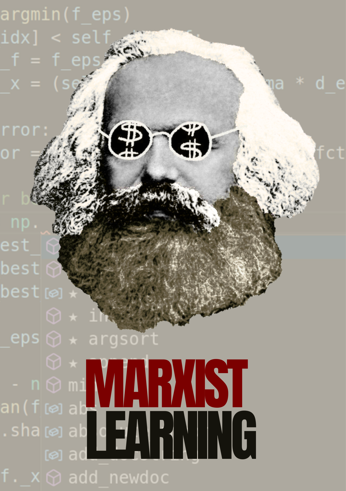

```{=html}
<div class="wide-page-shell about-me-shell">
  <header class="page-header-minimal" data-lang="en">
    <h1 class="page-title-minimal">About me</h1>
  </header>

  <header class="page-header-minimal" data-lang="es" style="display:none;">
    <h1 class="page-title-minimal">Sobre mí</h1>
  </header>

  <section class="page-wrap about-me-body" data-lang="en">
    <div class="about-me-layout about-me-layout--centered">
      <div class="about-me-content">
        <h2 class="about-me-subtitle">Intellectual Trajectory toward <span class="kw kw--computational">Computational Social Science</span>: The machine <s>marxist</s> learning</h2>
        <p>My current research agenda converges on <span class="kw kw--computational">Computational Social Science</span>, although this path is not immediately apparent from my earlier work.</p>
      </div>
      <div class="about-me-figure">
        
      </div>
    </div>
  </section>

  <section class="page-wrap about-me-body" data-lang="es" style="display:none;">
    <div class="about-me-layout about-me-layout--centered">
      <div class="about-me-content">
        <h2 class="about-me-subtitle">Trayectoria intelectual hacia la <span class="kw kw--computational">Ciencia Social Computacional</span>: El machine <s>marxist</s> learning</h2>
        <p>Mi agenda de investigación actual converge en la <span class="kw kw--computational">Ciencia Social Computacional</span>, aunque este derrotero no resulta evidente desde mis trabajos iniciales.</p>
      </div>
      <div class="about-me-figure">
        
      </div>
    </div>
  </section>
</div>
```
