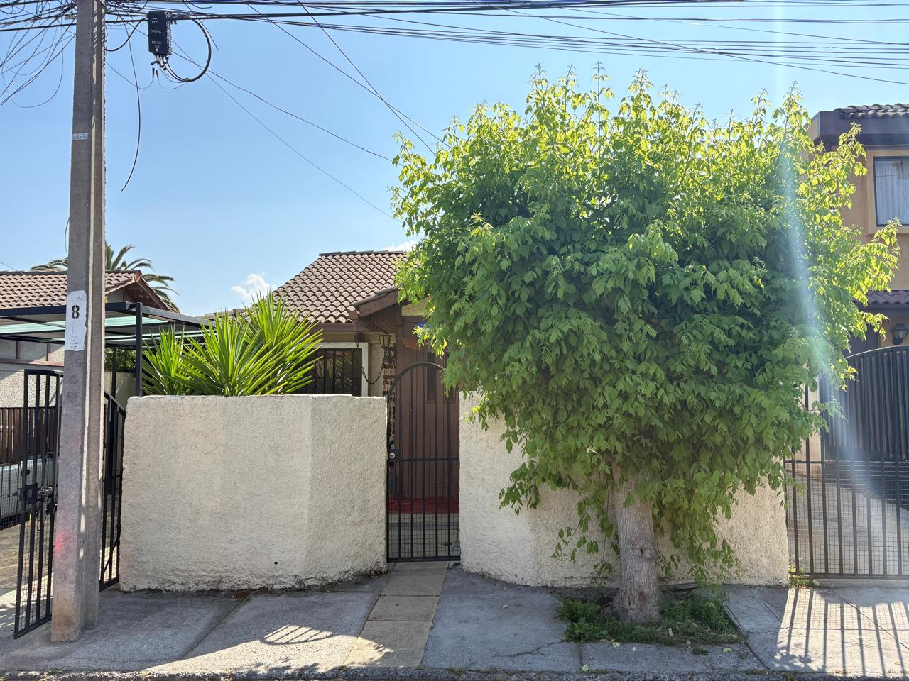

```{=html}
<div class="site-column home-page">

  <div data-lang="en" class="lang-pane">
    <section class="home-hero">
      <div class="home-hero__main">
        <h1 class="home-name">Matías<br>Deneken</h1>
        <p class="home-tagline">Sociologist &amp; <span class="kw kw--data">data scientist</span> working on <span class="kw kw--computational">computational social science</span>, <span class="kw kw--democracy">democracy</span>, and political <span class="kw kw--violence">violence</span>.</p>
        <div class="home-tags">
          <a class="home-tag" href="https://www.science.org/doi/full/10.1126/science.1167742" target="_blank" rel="noopener noreferrer">Computational Social Science</a>
          <a class="home-tag" href="https://arxiv.org/abs/2304.03442" target="_blank" rel="noopener noreferrer">Generative Agents</a>
          <a class="home-tag" href="https://www.journals.uchicago.edu/doi/full/10.1086/590649" target="_blank" rel="noopener noreferrer">Polarization</a>
        </div>
        <nav class="home-links" aria-label="External profiles">
          <a href="https://www.github.com/matdknu" target="_blank" rel="noopener noreferrer">GitHub</a>
          <a href="https://scholar.google.com/citations?user=matdknu" target="_blank" rel="noopener noreferrer">Scholar</a>
          <a href="https://www.linkedin.com/in/deneken/" target="_blank" rel="noopener noreferrer">LinkedIn</a>
          <a href="https://orcid.org" target="_blank" rel="noopener noreferrer">ORCID</a>
        </nav>
      </div>
      <aside class="home-hero__aside">
        
      </aside>
    </section>

    <hr class="site-rule">

    <section class="home-about">
      <div class="home-about__col">
        <h2 class="section-heading">Introduction</h2>
        <p>Matías Deneken is a Chilean sociologist and <span class="kw kw--data">data scientist</span> whose work sits at the intersection of the <span class="kw kw--violence">sociology of violence</span>, <span class="kw kw--democracy">democracy</span>, and <span class="kw kw--computational">computational social science</span>. His research examines how social processes unfold in contemporary societies through the rigorous application of <span class="kw kw--methods">quantitative and computational methods</span>. He has contributed to major large-scale longitudinal projects, including the <em>Estudio Longitudinal de Relaciones Interculturales (ELRI)</em> and the <em>Estudio Panel de Percepciones de Seguridad y Policías (EPSEP)</em>.</p>

        <h2 class="section-heading">Now</h2>
        <p>Today, Matías is fully committed to building <strong><a href="https://www.methodolab.com" target="_blank" rel="noopener noreferrer">MethodoLab</a></strong> — a <span class="kw kw--data">data science</span> initiative he founded to push the frontier of <span class="kw kw--methods">computational methods</span> in social research. He is also actively pursuing doctoral study opportunities <em>(exciting news coming soon)</em>.</p>
        <p><a href="https://www.methodolab.com" target="_blank" rel="noopener noreferrer" class="btn-outline">Visit MethodoLab →</a></p>
      </div>
      <div class="home-about__col">
        <h2 class="section-heading">Past experience</h2>
        <p>Matías was affiliated with the <strong>Observatory of <span class="kw kw--violence">Violence</span> and Social Legitimacy (OLES)</strong> (<a href="https://www.oles.cl/" target="_blank" rel="noopener noreferrer">www.oles.cl</a>), where he worked as a Research Assistant designing and maintaining large-scale longitudinal databases and conducting automated web scraping pipelines for systematic monitoring of national newspapers.</p>
        <p>He has been a <strong>Quantitative Studies Researcher</strong> at the <strong>Center for Intercultural and Indigenous Studies (CIIR)</strong> (<a href="https://www.ciir.cl/" target="_blank" rel="noopener noreferrer">www.ciir.cl</a>) since December 2022, where he coordinated the Longitudinal Survey on Intercultural Relations (ELRI) and co-edited the book <em>(RE) Configuraciones Interculturales</em>.</p>

        <h2 class="section-heading">Home</h2>
        <p>I was born and raised in the commune of Puente Alto. A bit of its history can be found <a href="https://www.memoriachilena.gob.cl/602/w3-article-582647.html#presentacion" target="_blank" rel="noopener noreferrer">here</a>.</p>
        
      </div>
    </section>

    <hr class="site-rule">

    <section class="home-agenda-cta">
      <a href="agenda.qmd" class="btn-outline">View agenda →</a>
    </section>

    <hr class="site-rule">

    <section class="home-recent">
      <header class="home-recent__header">Recent work</header>
      <ul class="home-recent__list">
        <li class="home-recent__item">
          <span class="home-recent__type">Preprint</span>
          <div class="home-recent__body">
            <p class="home-recent__title"><a href="https://www.crimrxiv.com/pub/3rl51qxc/release/1" target="_blank" rel="noopener noreferrer">Fear of the police and the fragility of legitimacy</a></p>
            <p class="home-recent__authors">Deneken &amp; Díaz</p>
            <p class="home-recent__venue">CrimRxiv</p>
          </div>
        </li>
        <li class="home-recent__item">
          <span class="home-recent__type">Book · 2025</span>
          <div class="home-recent__body">
            <p class="home-recent__title"><a href="https://books.google.co.uk/books/about/RE_Configuraciones_Interculturales.html?id=nM6YEQAAQBAJ&amp;redir_esc=y" target="_blank" rel="noopener noreferrer">(RE) Configuraciones Interculturales</a></p>
            <p class="home-recent__authors">Deneken, Valenzuela &amp; CIIR</p>
            <p class="home-recent__venue">Ed. Catalonia</p>
          </div>
        </li>
        <li class="home-recent__item">
          <span class="home-recent__type">Conference · 2026</span>
          <div class="home-recent__body">
            <p class="home-recent__title"><a href="https://deneken.me/comp-text_2026/#/title-slide" target="_blank" rel="noopener noreferrer">Elite Identification in Latin America</a></p>
            <p class="home-recent__authors">Deneken</p>
            <p class="home-recent__venue">COMPTEXT 2026</p>
          </div>
        </li>
      </ul>
    </section>
  </div>

  <div data-lang="es" class="lang-pane is-lang-hidden">
    <section class="home-hero">
      <div class="home-hero__main">
        <h1 class="home-name">Matías<br>Deneken</h1>
        <p class="home-tagline">Sociólogo y <span class="kw kw--data">científico de datos</span>. <span class="kw kw--computational">Ciencia social computacional</span>, <span class="kw kw--democracy">democracia</span> y <span class="kw kw--violence">violencia</span> política.</p>
        <div class="home-tags">
          <a class="home-tag" href="https://www.science.org/doi/full/10.1126/science.1167742" target="_blank" rel="noopener noreferrer">Ciencia Social Computacional</a>
          <a class="home-tag" href="https://arxiv.org/abs/2304.03442" target="_blank" rel="noopener noreferrer">Agentes Generativos</a>
          <a class="home-tag" href="https://www.journals.uchicago.edu/doi/full/10.1086/590649" target="_blank" rel="noopener noreferrer">Polarización</a>
        </div>
        <nav class="home-links" aria-label="Perfiles externos">
          <a href="https://www.github.com/matdknu" target="_blank" rel="noopener noreferrer">GitHub</a>
          <a href="https://scholar.google.com/citations?user=matdknu" target="_blank" rel="noopener noreferrer">Scholar</a>
          <a href="https://www.linkedin.com/in/deneken/" target="_blank" rel="noopener noreferrer">LinkedIn</a>
          <a href="https://orcid.org" target="_blank" rel="noopener noreferrer">ORCID</a>
        </nav>
      </div>
      <aside class="home-hero__aside">
        
      </aside>
    </section>

    <hr class="site-rule">

    <section class="home-about">
      <div class="home-about__col">
        <h2 class="section-heading">Introducción</h2>
        <p>Matías Deneken es un sociólogo y <span class="kw kw--data">científico de datos</span> chileno cuyo trabajo se sitúa en la intersección de la <span class="kw kw--violence">sociología de la violencia</span>, la <span class="kw kw--democracy">democracia</span> y la <span class="kw kw--computational">ciencia social computacional</span>. Ha colaborado en estudios longitudinales a gran escala como el <em>Estudio Longitudinal de Relaciones Interculturales (ELRI)</em> y el <em>Estudio Panel de Percepciones de Seguridad y Policías (EPSEP)</em>.</p>

        <h2 class="section-heading">Ahora</h2>
        <p>Actualmente está plenamente comprometido con <strong><a href="https://www.methodolab.com" target="_blank" rel="noopener noreferrer">MethodoLab</a></strong> — iniciativa de <span class="kw kw--data">ciencia de datos</span> que fundó para avanzar <span class="kw kw--methods">métodos computacionales</span> en investigación social. También busca oportunidades de estudio doctoral <em>(próximamente novedades)</em>.</p>
        <p><a href="https://www.methodolab.com" target="_blank" rel="noopener noreferrer" class="btn-outline">Visitar MethodoLab →</a></p>
      </div>
      <div class="home-about__col">
        <h2 class="section-heading">Experiencia</h2>
        <p>Estuvo afiliado al <strong>Observatorio de <span class="kw kw--violence">Violencia</span> y Legitimidad Social (OLES)</strong> (<a href="https://www.oles.cl/" target="_blank" rel="noopener noreferrer">www.oles.cl</a>), donde trabajó como Asistente de Investigación en bases de datos longitudinales y pipelines de scraping web.</p>
        <p>Es <strong>Investigador en Estudios Cuantitativos</strong> en el <strong>Centro de Estudios Interculturales e Indígenas (CIIR)</strong> (<a href="https://www.ciir.cl/" target="_blank" rel="noopener noreferrer">www.ciir.cl</a>) desde diciembre de 2022, donde coordinó la Encuesta Longitudinal de Relaciones Interculturales (ELRI) y co-editó <em>(RE) Configuraciones Interculturales</em>.</p>

        <h2 class="section-heading">Hogar</h2>
        <p>Nací y me crié en la comuna de Puente Alto. Un poco de su historia puede leerse <a href="https://www.memoriachilena.gob.cl/602/w3-article-582647.html#presentacion" target="_blank" rel="noopener noreferrer">aquí</a>.</p>
        
      </div>
    </section>

    <hr class="site-rule">

    <section class="home-agenda-cta">
      <a href="agenda.qmd" class="btn-outline">Ver agenda →</a>
    </section>

    <hr class="site-rule">

    <section class="home-recent">
      <header class="home-recent__header">Trabajo reciente</header>
      <ul class="home-recent__list">
        <li class="home-recent__item">
          <span class="home-recent__type">Preprint</span>
          <div class="home-recent__body">
            <p class="home-recent__title"><a href="https://www.crimrxiv.com/pub/3rl51qxc/release/1" target="_blank" rel="noopener noreferrer">Fear of the police and the fragility of legitimacy</a></p>
            <p class="home-recent__authors">Deneken &amp; Díaz</p>
            <p class="home-recent__venue">CrimRxiv</p>
          </div>
        </li>
        <li class="home-recent__item">
          <span class="home-recent__type">Libro · 2025</span>
          <div class="home-recent__body">
            <p class="home-recent__title"><a href="https://books.google.co.uk/books/about/RE_Configuraciones_Interculturales.html?id=nM6YEQAAQBAJ&amp;redir_esc=y" target="_blank" rel="noopener noreferrer">(RE) Configuraciones Interculturales</a></p>
            <p class="home-recent__authors">Deneken, Valenzuela &amp; CIIR</p>
            <p class="home-recent__venue">Ed. Catalonia</p>
          </div>
        </li>
        <li class="home-recent__item">
          <span class="home-recent__type">Conferencia · 2026</span>
          <div class="home-recent__body">
            <p class="home-recent__title"><a href="https://deneken.me/comp-text_2026/#/title-slide" target="_blank" rel="noopener noreferrer">Elite Identification in Latin America</a></p>
            <p class="home-recent__authors">Deneken</p>
            <p class="home-recent__venue">COMPTEXT 2026</p>
          </div>
        </li>
      </ul>
    </section>
  </div>

</div>

<script>
document.addEventListener("DOMContentLoaded", function () {
  document.querySelectorAll("a.home-tag").forEach(function (tag) {
    tag.addEventListener("mousedown", function () {
      tag.classList.add("is-active");
    });
    tag.addEventListener("mouseup", function () {
      window.setTimeout(function () {
        tag.classList.remove("is-active");
      }, 180);
    });
    tag.addEventListener("mouseleave", function () {
      tag.classList.remove("is-active");
    });
  });
});
</script>
```
