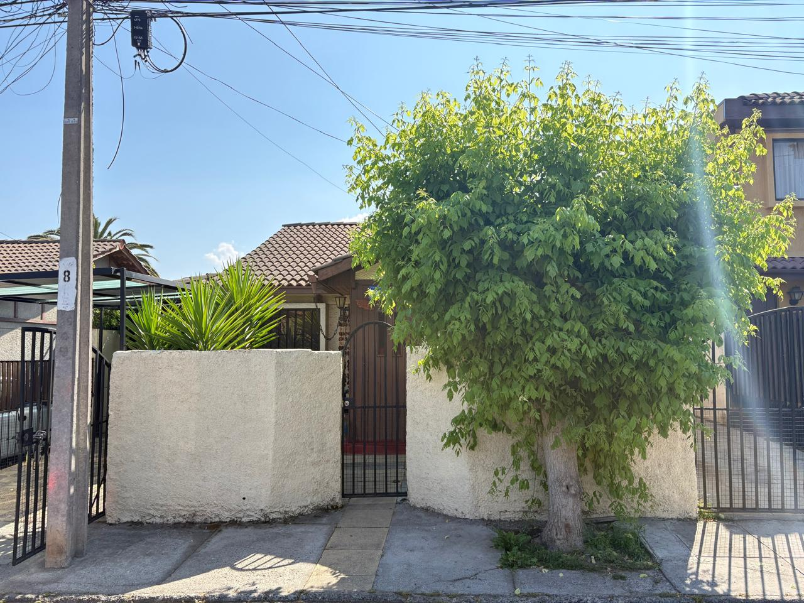
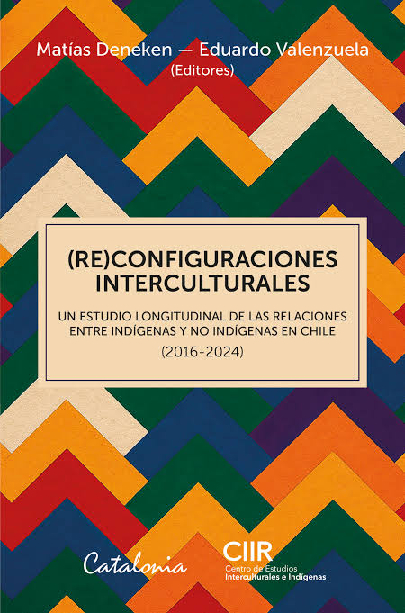
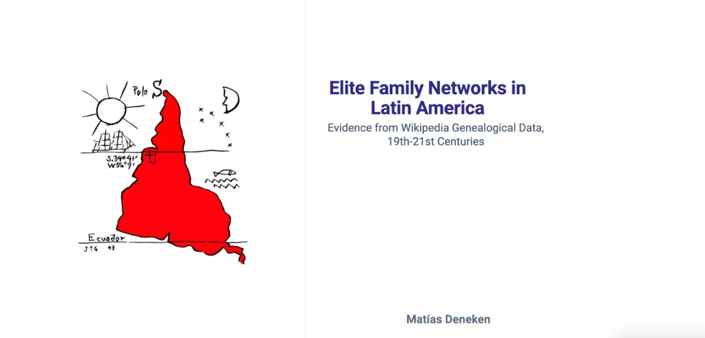

```{=html}
<div class="site-column home-page">

  <div data-lang="en" class="lang-pane">
    <div class="home-shell">
      <section class="home-hero">
        <div class="home-hero__row">
          <h1 class="home-name">Matías<br>Deneken</h1>
          <aside class="home-hero__aside">
            
          </aside>
        </div>
        <div class="home-hero__meta">
          <p class="home-tagline">Sociologist &amp; data scientist working on computational social science, democracy, and political violence.</p>
          <div class="home-tags">
            <a class="home-tag" href="https://www.science.org/doi/full/10.1126/science.1167742" target="_blank" rel="noopener noreferrer">Computational Social Science</a>
            <a class="home-tag" href="https://arxiv.org/abs/2304.03442" target="_blank" rel="noopener noreferrer">Generative Agents</a>
            <a class="home-tag" href="https://www.journals.uchicago.edu/doi/full/10.1086/590649" target="_blank" rel="noopener noreferrer">Polarization</a>
          </div>
          <nav class="home-links" aria-label="External profiles">
            <a href="https://www.github.com/matdknu" target="_blank" rel="noopener noreferrer">GitHub</a>
            <a href="https://www.linkedin.com/in/deneken/" target="_blank" rel="noopener noreferrer">LinkedIn</a>
          </nav>
        </div>
      </section>

      <hr class="site-rule">

      <section class="home-about">
        <div class="home-about__cell">
          <h2 class="section-heading">Introduction</h2>
          <p>Matías Deneken is a Chilean sociologist and <span class="kw kw--data">data scientist</span> whose work sits at the intersection of the <span class="kw kw--violence">sociology of violence</span>, <span class="kw kw--democracy">democracy</span>, and <span class="kw kw--computational">computational social science</span>. His research examines how social processes unfold in contemporary societies through the rigorous application of <span class="kw kw--methods">quantitative and computational methods</span>. He has contributed to major large-scale longitudinal projects, including the <em>Estudio Longitudinal de Relaciones Interculturales (ELRI)</em> and the <em>Estudio Panel de Percepciones de Seguridad y Policías (EPSEP)</em>.</p>
        </div>
        <div class="home-about__cell">
          <h2 class="section-heading">Now</h2>
          <p>Today, Matías is fully committed to building <strong><a href="https://www.methodolab.com" target="_blank" rel="noopener noreferrer">MethodoLab</a></strong> — a data science initiative he founded to push the <span class="kw kw--cream">frontier of computational methods in social research</span>. He is also actively pursuing doctoral study opportunities <em>(exciting news coming soon)</em>.</p>
          <p><a href="https://www.methodolab.com" target="_blank" rel="noopener noreferrer" class="btn-outline">Visit MethodoLab →</a></p>
        </div>
        <div class="home-about__cell">
          <h2 class="section-heading">Past experience</h2>
          <p>Matías was affiliated with the <strong>Observatory of Violence and Social Legitimacy (OLES)</strong> (<a href="https://www.oles.cl/" target="_blank" rel="noopener noreferrer">www.oles.cl</a>), where he worked as a Research Assistant designing and maintaining large-scale longitudinal databases and conducting automated web scraping pipelines for systematic monitoring of national newspapers.</p>
          <p>He has been a <strong>Quantitative Studies Researcher</strong> at the <strong>Center for Intercultural and Indigenous Studies (CIIR)</strong> (<a href="https://www.ciir.cl/" target="_blank" rel="noopener noreferrer">www.ciir.cl</a>) since December 2022, where he coordinated the Longitudinal Survey on Intercultural Relations (ELRI) and co-edited the book <em>(RE) Configuraciones Interculturales</em>.</p>
        </div>
        <div class="home-about__cell">
          <h2 class="section-heading">Home</h2>
          <p>I was born and raised in the commune of <span class="kw kw--cream">Puente Alto</span>. A bit of its history can be found <a href="https://www.memoriachilena.gob.cl/602/w3-article-582647.html#presentacion" target="_blank" rel="noopener noreferrer">here</a>.</p>
          
        </div>
      </section>

      <hr class="site-rule">

      <section class="home-lower">
        <section class="home-agenda-cta">
          <a href="agenda.qmd" class="btn-outline">View agenda →</a>
          <a href="photography.qmd" class="btn-outline">Photography →</a>
        </section>

        <hr class="site-rule">

        <section class="home-recent">
          <header class="home-recent__header">Recent work</header>
          <ul class="home-card-grid">
            <li>
              <a class="home-card" href="https://osf.io/hq3se/files/xu4fs" target="_blank" rel="noopener noreferrer">
                <div class="home-card__media">
                  
                </div>
                <div class="home-card__body">
                  <span class="home-card__type">In press</span>
                  <p class="home-card__title">Fear of the police and the fragility of legitimacy</p>
                  <p class="home-card__meta">Gerber et al.</p>
                  <p class="home-card__venue">International Journal of Social Psychology</p>
                </div>
              </a>
            </li>
            <li>
              <a class="home-card" href="https://books.google.co.uk/books/about/RE_Configuraciones_Interculturales.html?id=nM6YEQAAQBAJ&amp;redir_esc=y" target="_blank" rel="noopener noreferrer">
                <div class="home-card__media">
                  
                </div>
                <div class="home-card__body">
                  <span class="home-card__type">Book · 2025</span>
                  <p class="home-card__title">(RE) Configuraciones Interculturales</p>
                  <p class="home-card__meta">Deneken, Valenzuela &amp; CIIR</p>
                  <p class="home-card__venue">Ed. Catalonia</p>
                </div>
              </a>
            </li>
            <li>
              <a class="home-card" href="https://deneken.me/comp-text_2026/#/title-slide" target="_blank" rel="noopener noreferrer">
                <div class="home-card__media">
                  
                </div>
                <div class="home-card__body">
                  <span class="home-card__type">Conference · 2026</span>
                  <p class="home-card__title">Elite Identification in Latin America</p>
                  <p class="home-card__meta">Deneken</p>
                  <p class="home-card__venue">COMPTEXT 2026</p>
                </div>
              </a>
            </li>
          </ul>
        </section>

        <section class="home-projects">
          <header class="home-projects__header">Projects</header>
          <ul class="home-card-grid">
            <li>
              <a class="home-card" href="portafolio/shiny_long/index.qmd">
                <div class="home-card__media">
                  
                </div>
                <div class="home-card__body">
                  <span class="home-card__type">Dashboard · ELRI</span>
                  <p class="home-card__title">Longitudinal intercultural relations explorer</p>
                  <p class="home-card__meta">Interactive Shiny app for exploring ELRI panel waves (2016–2023): trust, contact, and identity.</p>
                  <p class="home-card__venue">R · Shiny · Survey data</p>
                </div>
              </a>
            </li>
            <li>
              <a class="home-card" href="projects.qmd#project-police-press">
                <div class="home-card__media">
                  
                </div>
                <div class="home-card__body">
                  <span class="home-card__type">Corpus · NLP</span>
                  <p class="home-card__title">Police legitimacy in Chilean online press</p>
                  <p class="home-card__meta">Large-scale scraping and computational discourse analysis of national newspapers (2000–2024).</p>
                  <p class="home-card__venue">Python · NLP · Longitudinal text</p>
                </div>
              </a>
            </li>
            <li>
              <a class="home-card" href="projects.qmd#project-elite-networks">
                <div class="home-card__media">
                  
                </div>
                <div class="home-card__body">
                  <span class="home-card__type">Methods · Networks</span>
                  <p class="home-card__title">Elite family networks in Latin America</p>
                  <p class="home-card__meta">Genealogical network extraction from Wikipedia biographies for elite identification research.</p>
                  <p class="home-card__venue">R · Network analysis · COMPTEXT</p>
                </div>
              </a>
            </li>
          </ul>
          <p class="home-projects__more"><a href="projects.qmd" class="btn-outline">All projects →</a></p>
        </section>
      </section>
    </div>
  </div>

  <div data-lang="es" class="lang-pane is-lang-hidden">
    <div class="home-shell">
      <section class="home-hero">
        <div class="home-hero__row">
          <h1 class="home-name">Matías<br>Deneken</h1>
          <aside class="home-hero__aside">
            
          </aside>
        </div>
        <div class="home-hero__meta">
          <p class="home-tagline">Sociólogo y científico de datos. Ciencia social computacional, democracia y violencia política.</p>
          <div class="home-tags">
            <a class="home-tag" href="https://www.science.org/doi/full/10.1126/science.1167742" target="_blank" rel="noopener noreferrer">Ciencia Social Computacional</a>
            <a class="home-tag" href="https://arxiv.org/abs/2304.03442" target="_blank" rel="noopener noreferrer">Agentes Generativos</a>
            <a class="home-tag" href="https://www.journals.uchicago.edu/doi/full/10.1086/590649" target="_blank" rel="noopener noreferrer">Polarización</a>
          </div>
          <nav class="home-links" aria-label="Perfiles externos">
            <a href="https://www.github.com/matdknu" target="_blank" rel="noopener noreferrer">GitHub</a>
            <a href="https://www.linkedin.com/in/deneken/" target="_blank" rel="noopener noreferrer">LinkedIn</a>
          </nav>
        </div>
      </section>

      <hr class="site-rule">

      <section class="home-about">
        <div class="home-about__cell">
          <h2 class="section-heading">Introducción</h2>
          <p>Matías Deneken es un sociólogo y <span class="kw kw--data">científico de datos</span> chileno cuyo trabajo se sitúa en la intersección de la <span class="kw kw--violence">sociología de la violencia</span>, la <span class="kw kw--democracy">democracia</span> y la <span class="kw kw--computational">ciencia social computacional</span>. Ha colaborado en estudios longitudinales a gran escala como el <em>Estudio Longitudinal de Relaciones Interculturales (ELRI)</em> y el <em>Estudio Panel de Percepciones de Seguridad y Policías (EPSEP)</em>.</p>
        </div>
        <div class="home-about__cell">
          <h2 class="section-heading">Ahora</h2>
          <p>Actualmente está plenamente comprometido con <strong><a href="https://www.methodolab.com" target="_blank" rel="noopener noreferrer">MethodoLab</a></strong> — iniciativa de ciencia de datos que fundó para avanzar la <span class="kw kw--cream">frontera de los métodos computacionales en investigación social</span>. También busca oportunidades de estudio doctoral <em>(próximamente novedades)</em>.</p>
          <p><a href="https://www.methodolab.com" target="_blank" rel="noopener noreferrer" class="btn-outline">Visitar MethodoLab →</a></p>
        </div>
        <div class="home-about__cell">
          <h2 class="section-heading">Experiencia</h2>
          <p>Estuvo afiliado al <strong>Observatorio de Violencia y Legitimidad Social (OLES)</strong> (<a href="https://www.oles.cl/" target="_blank" rel="noopener noreferrer">www.oles.cl</a>), donde trabajó como Asistente de Investigación en bases de datos longitudinales y pipelines de scraping web.</p>
          <p>Es <strong>Investigador en Estudios Cuantitativos</strong> en el <strong>Centro de Estudios Interculturales e Indígenas (CIIR)</strong> (<a href="https://www.ciir.cl/" target="_blank" rel="noopener noreferrer">www.ciir.cl</a>) desde diciembre de 2022, donde coordinó la Encuesta Longitudinal de Relaciones Interculturales (ELRI) y co-editó <em>(RE) Configuraciones Interculturales</em>.</p>
        </div>
        <div class="home-about__cell">
          <h2 class="section-heading">Hogar</h2>
          <p>Nací y me crié en la comuna de <span class="kw kw--cream">Puente Alto</span>. Un poco de su historia puede leerse <a href="https://www.memoriachilena.gob.cl/602/w3-article-582647.html#presentacion" target="_blank" rel="noopener noreferrer">aquí</a>.</p>
          
        </div>
      </section>

      <hr class="site-rule">

      <section class="home-lower">
        <section class="home-agenda-cta">
          <a href="agenda.qmd" class="btn-outline">Ver agenda →</a>
          <a href="photography.qmd" class="btn-outline">Fotografía →</a>
        </section>

        <hr class="site-rule">

        <section class="home-recent">
          <header class="home-recent__header">Trabajo reciente</header>
          <ul class="home-card-grid">
            <li>
              <a class="home-card" href="https://osf.io/hq3se/files/xu4fs" target="_blank" rel="noopener noreferrer">
                <div class="home-card__media">
                  
                </div>
                <div class="home-card__body">
                  <span class="home-card__type">In press</span>
                  <p class="home-card__title">Fear of the police and the fragility of legitimacy</p>
                  <p class="home-card__meta">Gerber et al.</p>
                  <p class="home-card__venue">International Journal of Social Psychology</p>
                </div>
              </a>
            </li>
            <li>
              <a class="home-card" href="https://books.google.co.uk/books/about/RE_Configuraciones_Interculturales.html?id=nM6YEQAAQBAJ&amp;redir_esc=y" target="_blank" rel="noopener noreferrer">
                <div class="home-card__media">
                  
                </div>
                <div class="home-card__body">
                  <span class="home-card__type">Libro · 2025</span>
                  <p class="home-card__title">(RE) Configuraciones Interculturales</p>
                  <p class="home-card__meta">Deneken, Valenzuela &amp; CIIR</p>
                  <p class="home-card__venue">Ed. Catalonia</p>
                </div>
              </a>
            </li>
            <li>
              <a class="home-card" href="https://deneken.me/comp-text_2026/#/title-slide" target="_blank" rel="noopener noreferrer">
                <div class="home-card__media">
                  
                </div>
                <div class="home-card__body">
                  <span class="home-card__type">Conferencia · 2026</span>
                  <p class="home-card__title">Elite Identification in Latin America</p>
                  <p class="home-card__meta">Deneken</p>
                  <p class="home-card__venue">COMPTEXT 2026</p>
                </div>
              </a>
            </li>
          </ul>
        </section>

        <section class="home-projects">
          <header class="home-projects__header">Proyectos</header>
          <ul class="home-card-grid">
            <li>
              <a class="home-card" href="portafolio/shiny_long/index.qmd">
                <div class="home-card__media">
                  
                </div>
                <div class="home-card__body">
                  <span class="home-card__type">Dashboard · ELRI</span>
                  <p class="home-card__title">Explorador longitudinal de relaciones interculturales</p>
                  <p class="home-card__meta">App Shiny para explorar las olas del panel ELRI (2016–2023): confianza, contacto e identidad.</p>
                  <p class="home-card__venue">R · Shiny · Encuestas</p>
                </div>
              </a>
            </li>
            <li>
              <a class="home-card" href="projects.qmd#project-police-press">
                <div class="home-card__media">
                  
                </div>
                <div class="home-card__body">
                  <span class="home-card__type">Corpus · NLP</span>
                  <p class="home-card__title">Legitimidad policial en la prensa digital chilena</p>
                  <p class="home-card__meta">Scraping a gran escala y análisis computacional de discurso en medios nacionales (2000–2024).</p>
                  <p class="home-card__venue">Python · NLP · Texto longitudinal</p>
                </div>
              </a>
            </li>
            <li>
              <a class="home-card" href="projects.qmd#project-elite-networks">
                <div class="home-card__media">
                  
                </div>
                <div class="home-card__body">
                  <span class="home-card__type">Métodos · Redes</span>
                  <p class="home-card__title">Redes familiares de élites en América Latina</p>
                  <p class="home-card__meta">Extracción de redes genealógicas desde biografías de Wikipedia para identificar élites.</p>
                  <p class="home-card__venue">R · Análisis de redes · COMPTEXT</p>
                </div>
              </a>
            </li>
          </ul>
          <p class="home-projects__more"><a href="projects.qmd" class="btn-outline">Todos los proyectos →</a></p>
        </section>
      </section>
    </div>
  </div>

</div>

<script>
document.addEventListener("DOMContentLoaded", function () {
  function wirePressFeedback(selector) {
    document.querySelectorAll(selector).forEach(function (el) {
      el.addEventListener("mousedown", function () {
        el.classList.add("is-active");
      });
      el.addEventListener("mouseup", function () {
        window.setTimeout(function () {
          el.classList.remove("is-active");
        }, 180);
      });
      el.addEventListener("mouseleave", function () {
        el.classList.remove("is-active");
      });
    });
  }

  wirePressFeedback("a.home-tag");
  wirePressFeedback(".home-agenda-cta .btn-outline");
  wirePressFeedback(".home-about .btn-outline");
  wirePressFeedback(".home-projects__more .btn-outline");
  wirePressFeedback("a.home-card");
});
</script>
```
