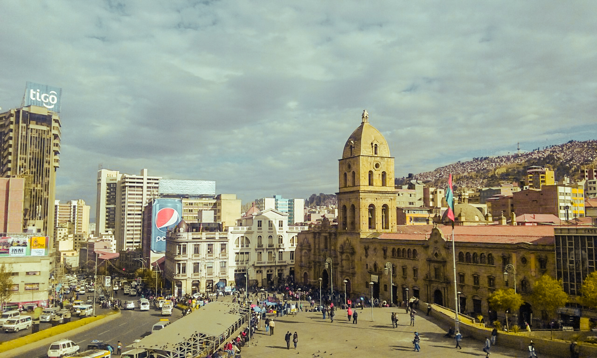
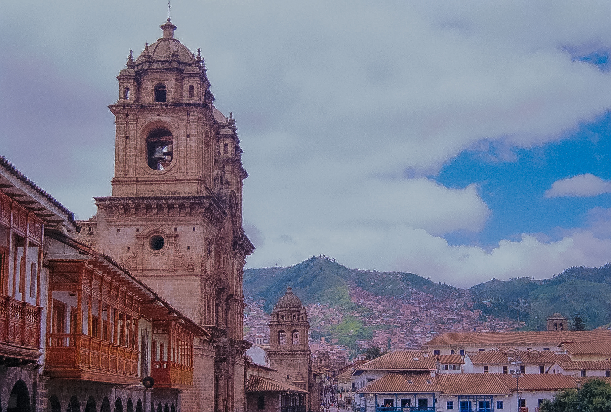
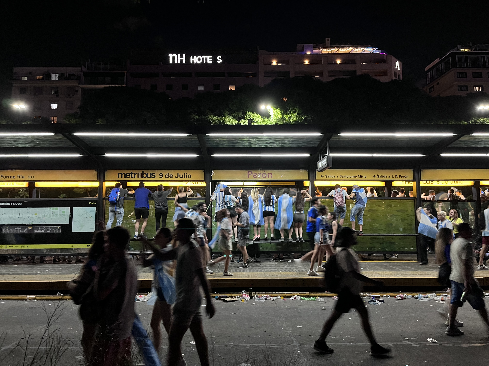
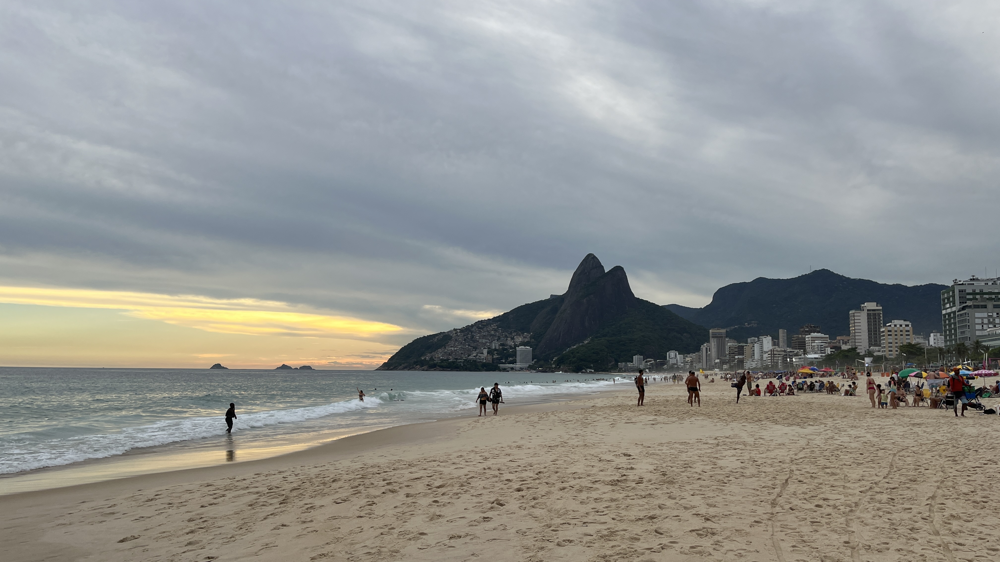

```{=html}
<div class="photography-shell">
  <header class="page-header-minimal" data-lang="en">
    <h1 class="page-title-minimal">Photography</h1>
  </header>

  <header class="page-header-minimal" data-lang="es" style="display:none;">
    <h1 class="page-title-minimal">Fotografía</h1>
  </header>

  <section class="photography-body">
    <div class="photo-gallery" id="photo-gallery">

      <button type="button" class="photo-card"
        data-full="files/images/photos/torres_del_paine.JPG"
        data-caption-en="Torres del Paine, Chile"
        data-caption-es="Torres del Paine, Chile">
        
        <span class="photo-card__caption">Torres del Paine</span>
      </button>

      <button type="button" class="photo-card"
        data-full="files/images/photos/flamencos_atacama.JPG"
        data-caption-en="Flamingos, Atacama"
        data-caption-es="Flamencos, Atacama">
        
        <span class="photo-card__caption">Flamencos · Atacama</span>
      </button>

      <button type="button" class="photo-card"
        data-full="files/images/photos/atacama_desierto.JPG"
        data-caption-en="Atacama Desert"
        data-caption-es="Desierto de Atacama">
        
        <span class="photo-card__caption">Atacama Desert</span>
      </button>

      <button type="button" class="photo-card"
        data-full="files/images/photos/punta_arenas.JPG"
        data-caption-en="Punta Arenas waterfront"
        data-caption-es="Costanera de Punta Arenas">
        
        <span class="photo-card__caption">Punta Arenas</span>
      </button>

      <button type="button" class="photo-card"
        data-full="files/images/photos/puerto_natales.JPG"
        data-caption-en="Puerto Natales"
        data-caption-es="Puerto Natales">
        
        <span class="photo-card__caption">Puerto Natales</span>
      </button>

      <button type="button" class="photo-card"
        data-full="files/images/photos/la-paz.JPG"
        data-caption-en="La Paz, Bolivia"
        data-caption-es="La Paz, Bolivia">
        
        <span class="photo-card__caption">La Paz</span>
      </button>

      <button type="button" class="photo-card"
        data-full="files/images/photos/cuzco.JPG"
        data-caption-en="Cusco, Peru"
        data-caption-es="Cusco, Perú">
        
        <span class="photo-card__caption">Cusco</span>
      </button>

      <button type="button" class="photo-card"
        data-full="files/images/photos/buenos-aires.JPG"
        data-caption-en="Buenos Aires — when Argentina were world champions (2022)"
        data-caption-es="Buenos Aires — cuando fueron campeones del mundo (2022)">
        
        <span class="photo-card__caption">Buenos Aires · campeones del mundo</span>
      </button>

      <button type="button" class="photo-card"
        data-full="files/images/photos/rio-janeiro.JPEG"
        data-caption-en="Rio de Janeiro"
        data-caption-es="Río de Janeiro">
        
        <span class="photo-card__caption">Río de Janeiro</span>
      </button>

      <button type="button" class="photo-card"
        data-full="files/images/photos/chapultepec-cdmx.JPG"
        data-caption-en="Chapultepec, Mexico City"
        data-caption-es="Chapultepec, Ciudad de México">
        
        <span class="photo-card__caption">Chapultepec · CDMX</span>
      </button>

      <button type="button" class="photo-card"
        data-full="files/images/photos/amsterdam.JPG"
        data-caption-en="Amsterdam"
        data-caption-es="Ámsterdam">
        
        <span class="photo-card__caption">Amsterdam</span>
      </button>

      <button type="button" class="photo-card"
        data-full="files/images/photos/museo_yugslavia.JPG"
        data-caption-en="Museum of Yugoslavia, Belgrade"
        data-caption-es="Museo de Yugoslavia, Belgrado">
        
        <span class="photo-card__caption">Museo de Yugoslavia</span>
      </button>

    </div>
  </section>
</div>

<div id="photo-lightbox" class="photo-lightbox" hidden aria-hidden="true" role="dialog" aria-modal="true" aria-label="Photo viewer">
  <button type="button" class="photo-lightbox__backdrop" aria-label="Close"></button>
  <div class="photo-lightbox__panel">
    <button type="button" class="photo-lightbox__close" aria-label="Close">&times;</button>
    <button type="button" class="photo-lightbox__nav photo-lightbox__nav--prev" aria-label="Previous photo">&#8249;</button>
    <figure class="photo-lightbox__figure">
      
      <figcaption class="photo-lightbox__caption"></figcaption>
    </figure>
    <button type="button" class="photo-lightbox__nav photo-lightbox__nav--next" aria-label="Next photo">&#8250;</button>
  </div>
</div>

<script>
document.addEventListener("DOMContentLoaded", function () {
  var lightbox = document.getElementById("photo-lightbox");
  if (!lightbox) return;

  var imgEl = lightbox.querySelector(".photo-lightbox__img");
  var capEl = lightbox.querySelector(".photo-lightbox__caption");
  var closeBtn = lightbox.querySelector(".photo-lightbox__close");
  var backdrop = lightbox.querySelector(".photo-lightbox__backdrop");
  var prevBtn = lightbox.querySelector(".photo-lightbox__nav--prev");
  var nextBtn = lightbox.querySelector(".photo-lightbox__nav--next");
  var cards = [];
  var index = 0;

  function refreshCards() {
    var gallery = document.getElementById("photo-gallery");
    cards = gallery ? Array.prototype.slice.call(gallery.querySelectorAll(".photo-card")) : [];
  }

  function captionFor(card) {
    var lang = localStorage.getItem("site-lang") || "en";
    return lang === "es"
      ? card.getAttribute("data-caption-es") || card.getAttribute("data-caption-en")
      : card.getAttribute("data-caption-en");
  }

  function showAt(i) {
    refreshCards();
    if (!cards.length) return;
    index = (i + cards.length) % cards.length;
    var card = cards[index];
    var src = card.getAttribute("data-full");
    imgEl.src = src;
    imgEl.alt = captionFor(card) || "";
    capEl.textContent = captionFor(card) || "";
    lightbox.hidden = false;
    lightbox.setAttribute("aria-hidden", "false");
    document.body.classList.add("photo-lightbox-open");
    closeBtn.focus();
  }

  function closeLb() {
    lightbox.hidden = true;
    lightbox.setAttribute("aria-hidden", "true");
    document.body.classList.remove("photo-lightbox-open");
    imgEl.removeAttribute("src");
  }

  document.querySelectorAll(".photo-gallery").forEach(function (gallery) {
    gallery.addEventListener("click", function (evt) {
      var card = evt.target.closest(".photo-card");
      if (!card) return;
      refreshCards();
      index = cards.indexOf(card);
      if (index < 0) index = 0;
      showAt(index);
    });
  });

  closeBtn.addEventListener("click", closeLb);
  backdrop.addEventListener("click", closeLb);
  prevBtn.addEventListener("click", function () { showAt(index - 1); });
  nextBtn.addEventListener("click", function () { showAt(index + 1); });

  document.addEventListener("keydown", function (evt) {
    if (lightbox.hidden) return;
    if (evt.key === "Escape") closeLb();
    if (evt.key === "ArrowLeft") showAt(index - 1);
    if (evt.key === "ArrowRight") showAt(index + 1);
  });
});
</script>
```
