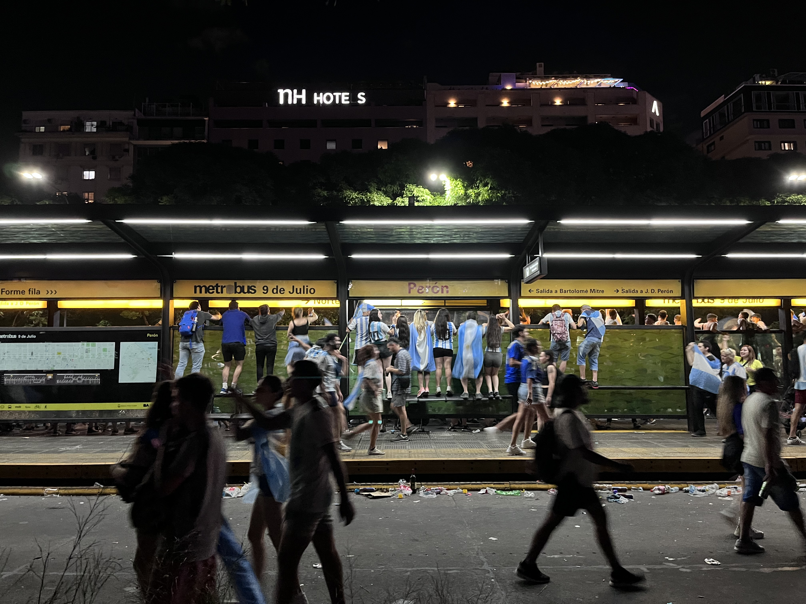
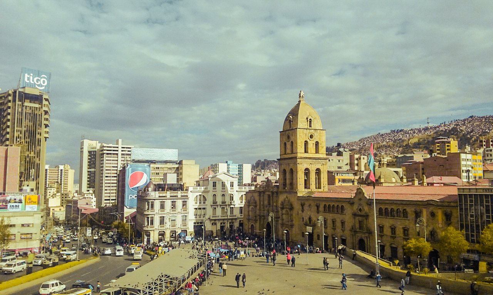

```{=html}
<div class="wide-page-shell projects-shell">
  <header class="page-header-minimal" data-lang="en">
    <h1 class="page-title-minimal">Projects</h1>
  </header>

  <header class="page-header-minimal" data-lang="es" style="display:none;">
    <h1 class="page-title-minimal">Proyectos</h1>
  </header>

  <section class="page-wrap projects-body" data-lang="en">
    <ul class="home-card-grid projects-card-grid">
      <li id="project-elri">
        <a class="home-card" href="portafolio/shiny_long/index.qmd">
          <div class="home-card__media">
            
          </div>
          <div class="home-card__body">
            <span class="home-card__type">Dashboard · ELRI</span>
            <p class="home-card__title">Longitudinal intercultural relations explorer</p>
            <p class="home-card__meta">Interactive Shiny app for exploring ELRI panel waves (2016–2023): trust, contact, and identity.</p>
            <p class="home-card__venue">R · Shiny · Survey data</p>
          </div>
        </a>
      </li>
      <li id="project-police-press">
        <a class="home-card" href="#project-police-press">
          <div class="home-card__media">
            
          </div>
          <div class="home-card__body">
            <span class="home-card__type">Corpus · NLP</span>
            <p class="home-card__title">Police legitimacy in Chilean online press</p>
            <p class="home-card__meta">Large-scale scraping and computational discourse analysis of national newspapers (2000–2024).</p>
            <p class="home-card__venue">Python · NLP · Longitudinal text</p>
          </div>
        </a>
      </li>
      <li id="project-elite-networks">
        <a class="home-card" href="#project-elite-networks">
          <div class="home-card__media">
            
          </div>
          <div class="home-card__body">
            <span class="home-card__type">Methods · Networks</span>
            <p class="home-card__title">Elite family networks in Latin America</p>
            <p class="home-card__meta">Genealogical network extraction from Wikipedia biographies for elite identification research.</p>
            <p class="home-card__venue">R · Network analysis · COMPTEXT</p>
          </div>
        </a>
      </li>
    </ul>
  </section>

  <section class="page-wrap projects-body" data-lang="es" style="display:none;">
    <ul class="home-card-grid projects-card-grid">
      <li id="project-elri-es">
        <a class="home-card" href="portafolio/shiny_long/index.qmd">
          <div class="home-card__media">
            
          </div>
          <div class="home-card__body">
            <span class="home-card__type">Dashboard · ELRI</span>
            <p class="home-card__title">Explorador longitudinal de relaciones interculturales</p>
            <p class="home-card__meta">App Shiny para explorar las olas del panel ELRI (2016–2023): confianza, contacto e identidad.</p>
            <p class="home-card__venue">R · Shiny · Encuestas</p>
          </div>
        </a>
      </li>
      <li id="project-police-press-es">
        <a class="home-card" href="#project-police-press">
          <div class="home-card__media">
            
          </div>
          <div class="home-card__body">
            <span class="home-card__type">Corpus · NLP</span>
            <p class="home-card__title">Legitimidad policial en la prensa digital chilena</p>
            <p class="home-card__meta">Scraping a gran escala y análisis computacional de discurso en medios nacionales (2000–2024).</p>
            <p class="home-card__venue">Python · NLP · Texto longitudinal</p>
          </div>
        </a>
      </li>
      <li id="project-elite-networks-es">
        <a class="home-card" href="#project-elite-networks">
          <div class="home-card__media">
            
          </div>
          <div class="home-card__body">
            <span class="home-card__type">Métodos · Redes</span>
            <p class="home-card__title">Redes familiares de élites en América Latina</p>
            <p class="home-card__meta">Extracción de redes genealógicas desde biografías de Wikipedia para identificar élites.</p>
            <p class="home-card__venue">R · Análisis de redes · COMPTEXT</p>
          </div>
        </a>
      </li>
    </ul>
  </section>
</div>
```
